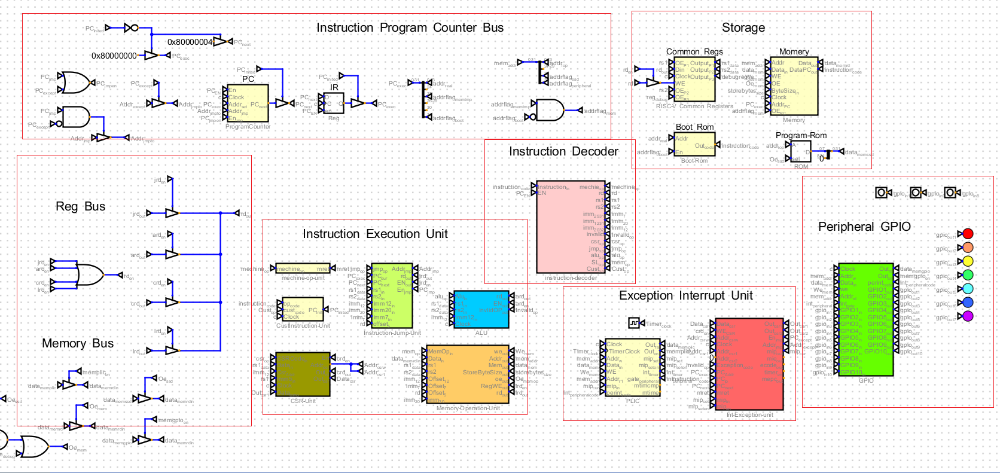
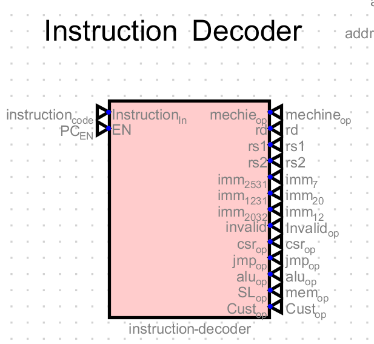
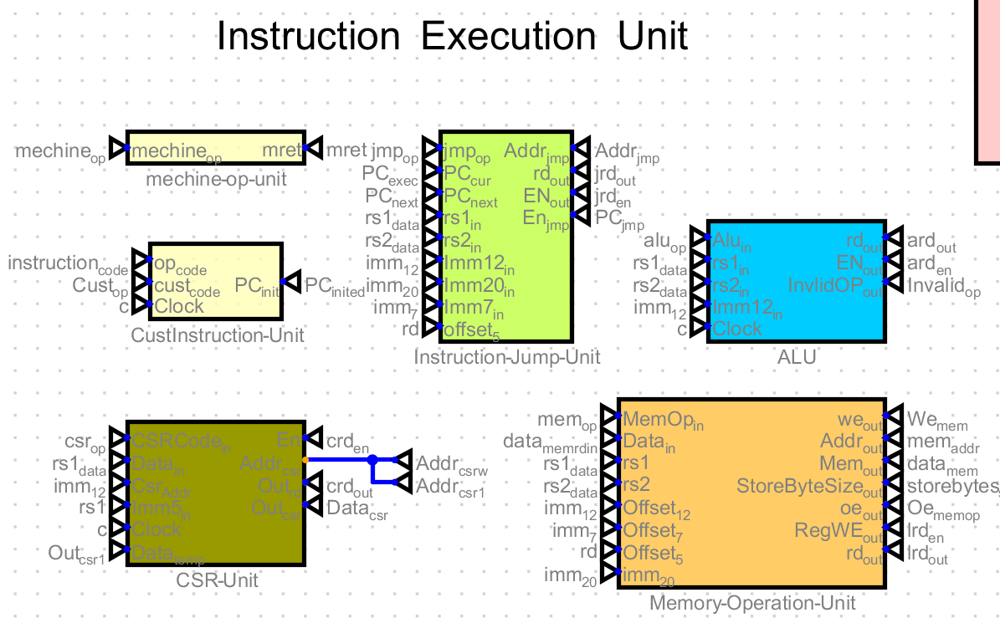
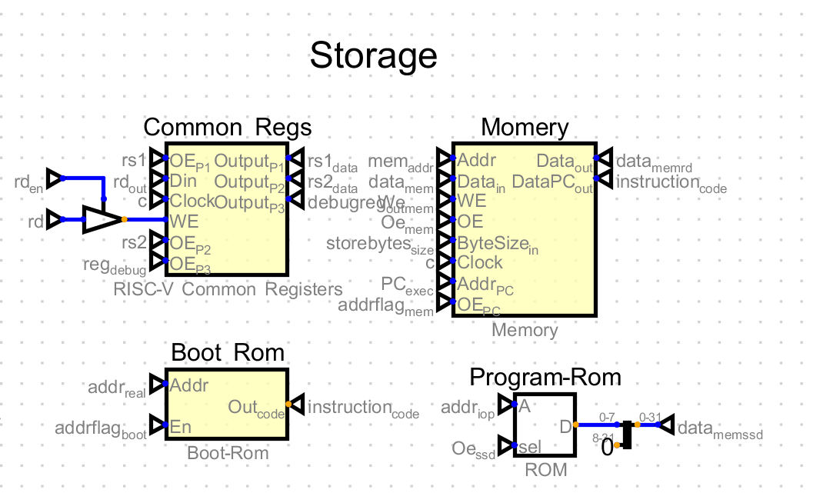
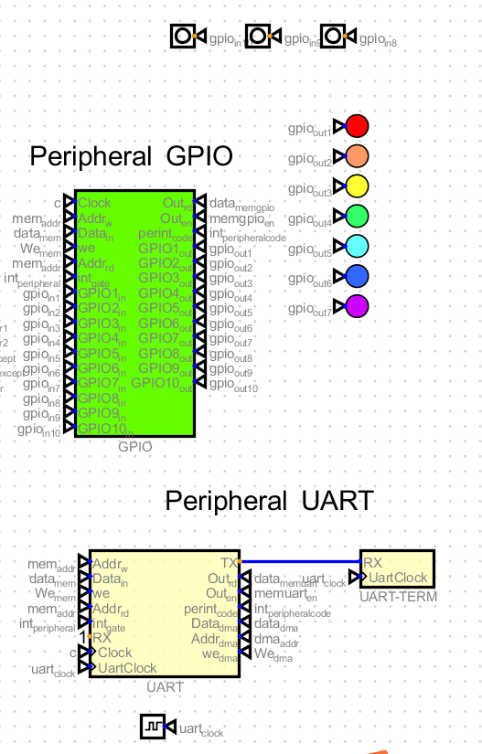

# riscv-mcu

#### 介绍

B站讲解视频: [讲解合集](https://space.bilibili.com/505193782/channel/collectiondetail?sid=3829887) 

基于Digital数字电路仿真软件 [下载链接](https://github.com/hneemann/Digital),构建支持简易指令集的CPU以及简单的外设电路仿真。  
目标能够支持系统的引导、启动、运行、中断处理、外设控制等功能。

本项目用于辅助学习CPU结构/数字电路设计，微机组成原理，汇编/C语言开发，嵌入式开发等技术入门。

为了便于演示，当前支持了完整的RISCV32I指令集，以及部分外设电路，如定时器、GPIO等。基于入门学习的目的，当前仅支持单周期CPU，未采用多级流水线和cache技术，所有指令执行都设计为单周期执行指令，无指令乱序和多级发射等特性。

支持通过risc-v汇编、C语言编写boot引导程序和固件程序，通过Digital数字电路仿真软件进行仿真运行。

RISC-V为当前活跃的开源指令集，具体参见 [RISC-V](https://riscv.org/)。

#### 安装说明
1.  下载Digital数字电路仿真软件 [链接](https://github.com/hneemann/Digital)
2.  下载本项目代码
    ```
    git clone https://gitee.com/virtual-computer/cpu-v.git
    ```
3.  打开Digital数字电路仿真软件， 点击文件-打开，选择项目digital目录下的 `risc-v-computer.dig` 文件。
4.  点击运行仿真按钮

#### 运行演示


仿真运行后，首先加载引导程序，引导程序存放在boot-rom中，引导程序将固件程序加载从program-rom加载到内存中，然后跳转到固件程序入口地址开始执行固件程序。

示例中为固件程序通过GPIO控制LED灯，通过定时器控制LED灯的闪烁。通过硬件中断实现GPIO输入检测，并改变LED闪烁方式。

#### 硬件架构
系统整体包含：指令取指总线、指令解码器、指令执行单元、存储器、异常中断处理单元、外设模块、内部数据总线等模块。




* 指令取指总线
  > 包含指令初始指令地址、地址寄存器（PC）、指令寄存器（IR）、指令访存选择四个部分。  
    初始指令固定从0x80000000地址加载，为系统上电后第一条指令的地址，系统引导程序也是从这里开始执行。  
    地址寄存器（PC）用于存储当前指令的地址，并计算下一条指令地址，在本系统中，指令地址固定按照4字节对齐，所以固下一条指令地址为当前指令地址PC+4。同时PC还和跳转指令执行单元、异常中断处理单元有直接连线，如果当前指令为跳转指令或者有待处理异常或终端，都可以直接修改下一条指令地址，从而实现单周期的执行执行，避免了指令预测和流水线冲刷等过程。  
    指令寄存器（IR）用于存储当前指令，当前执行指令地址通过指令访存选择电路从正确的rom或者ram中获取到指令码，然后将指令码传递给指令译码器解码。  
    指令访存选择为一系列选择电路，通过指令地址高位判断指令地址，本系统中指令地址只有0x80000000和0x02000000两个其实地址，高位字节为 0x80 从boot-rom中获取指令，高位字节为0x02 从ram中获取指令。

* 指令解码器
    

  > 包含指令译码器（ID）支持RISCV32I整数基础指令集译码，支持50条指令，输入电路为32位指令码，解析后分别输出逻辑与计算指令、跳转指令、csr访问指令、内存加载/写入指令、机器模式指令、自定义指令6个分类，并连线到各个对应的指令执行单元，通过不同的数据线电平表示具体的指令信息。同时提前建I R S J U B 6类指令格式的各个字段数据解析，并引出数据连线，后续执行单元可以直接读取。

* 指令执行单元
    

  > ALU逻辑与计算单元，实现and/or/add/sub/slli等指令。  
    跳转指令单元，实现jal/bne等指令。  
    CSR访问指令单元，实现csrrw/csrrs/csrrc/csrrwi/csrrsi/csrrci等指令。  
    内存加载/写入指令单元，实现lw/sw指令。  
    机器模式指令单元，实现mret指令。  
    自定义指令单元，当前仅实现了一条指令0x8000007F，用于实现启动模式到正常执行模式转换。  

* 存储器
    
  
  > 通用寄存器，实现了x0 ~ x31 共32个通用寄存器。  
    内存模块，实现了32位宽的内存，支持读写操作，通过4个block片选组合的方式，实现了非对齐字节操作，可以在单周期内实现4字节及以下的任意读写指令。  
    boot-rom，实现了32位宽的rom，支持读操作，用于存储引导程序，支持32位对齐，不支持字节操作。  
    Program-ram，实现了8位宽的ram，支持读操作，支持字节读取，在引导程序加载固件程序到内存时，只能按照字节加载。
    DMA， 实现了32位宽的内存，支持外设直接读写操作，支持非对齐字节操作。0xC0000000 为DMA的其实基地址。

* 异常中断处理单元
    

  > PLIC实现了一个定时器中断源，定制器使用一个独立的时钟，并提供统一的硬件外设中断管理。  
    异常中断处理模块实现了异常中断处理，包括异常码、异常类型、中断类型、中断号、中断优先级、中断使能、中断触发、中断屏蔽、中断挂起、中断返回地址等信号，异常优先级最高，硬件中断、软件中断、时钟中断 这样的优先级次序，不支持中断嵌套。

* 外设模块
    

  > GPIO 实现了包含10个gpio口的硬件外设，支持输入输出方式配置，支持输入硬件中断触发。  
    Uart 实现了一个串口外设，支持串口数据收发。 [详细说明](doc/uart_zh.md)

* 内部数据总线
  

  > 包含指令取指总线、指令解码器、指令执行单元、存储器、异常中断处理单元、外设模块等模块之间的数据传输总线。


#### 软件程序
  软件程序包含boot引导程序和固件程序两个部分。  
  * boot引导程序
    > boot引导程序用于加载固件程序到内存，并跳转到固件程序入口地址开始执行。  
      boot引导程序存放在boot-rom中，引导程序将固件程序加载从program-rom加载到内存中，然后跳转到固件程序入口地址开始执行固件程序。  
      boot引导程序使用risc-v汇编语言编写，具体参见 `src/boot.s` 文件。

  * 固件程序
    > 通过start.s 启动，在start.s中设置了中断处理函数和设置，然后跳转到C语言的main函数中开始执行。  
      在src/bsp目录下，对gpio、定时器、中断等操作，做了对应的代码封装，方便在C语言中调用。  
      在src/main.c中，通过调用bsp中的代码，实现了一个简单的固件程序，通过GPIO控制LED灯，通过定时器控制LED灯的闪烁。通过硬件中断实现GPIO输入检测，并改变LED闪烁方式。在代码中包含一个sleep延时实现的版本和通过中断实现的版本示例。
      固件程序使用C语言编写，具体参见 `src/main.c` 文件。
      ```c
        #include "gpio.h"
        #include "timer.h"
        #include "interrupt.h"

        static int mode = 0;

        void flash_by_sleep() {
            // set low 7 pins of port D as output
            set_all_pins_mode(0x7f);
            for(;;) {
                mode = get_pin(10);
                if(mode) {
                    set_all_pins(get_all_pins() | 0x7f);
                    sleep(500);
                    set_all_pins(get_all_pins() & ~0x7f);
                    sleep(500);
                } else {
                    for(int i=1;i<8 && mode==0;i++) {
                        set_pin(i, 1);
                        sleep(500);
                        set_pin(i, 0);
                    }
                }
            }
        }

        static int cur_pin = 0;
        static int cur_pins_status = 0;

        void flash_timer_handler() {
            // set low 7 pins of port D as output
            set_all_pins_mode(0x7f);
            if(mode) {
                if(cur_pins_status) {
                    set_all_pins(get_all_pins() & ~0x7f);
                    cur_pins_status = 0;
                }else{
                    set_all_pins(get_all_pins() | 0x7f);
                    cur_pins_status = 1;
                }
            } else {
                set_all_pins(get_all_pins() & ~0x7f);
                cur_pin++;
                if(cur_pin > 7) {
                    cur_pin = 1;
                }
                set_pin(cur_pin, 1);
            }
            add_soft_timer(500, flash_timer_handler);
        }

        void mode_change_handler() {
            mode = get_pin(10);
            clear_gpio_int();
        }

        void flash_by_interrupt() {
            init_global_timer();
            add_soft_timer(500, flash_timer_handler);
            register_peripheral_int_handler(INT_GPIO,mode_change_handler);
            for(;;) {}
        }

        int main() {
            // flash_by_sleep();
            flash_by_interrupt();
            return 0;
        }
          ```

#### 软件编译
  引导和固件程序需要使用risc-v交叉编译工具链进行编译。  
  交叉编译工具链 [riscv-gnu-toolchain](https://github.com/riscv-collab/riscv-gnu-toolchain)  
  国内用户可以使用镜像地址: [riscv-gnu-toolchain](https://gitee.com/riscv-mcu/riscv-gnu-toolchain)  

  > 本项目只支持32为指令集，所以编译的时候需要指定32位  

  ```
  ./configure --prefix=/opt/riscv --with-arch=rv32gc --with-abi=ilp32d   
  make linux
  ```

  工具链编译完毕后，将bin目录加入到系统PATH中，然后可以在src目录下执行 make 进行编译。

  ```
      export PATH=$PATH:/opt/riscv/bin
      cd src
      make
  ```
  编译完成后，将生成的boot.bin和kernel.bin 分别为引导程序和 固件程序。  
  在Digital工具中，需要将编译后的字节hex文本导入到program-rom中，可以在src目录下执行 python3 ./mkhex.py 生成hex文件。

  ```
      cd src
      python3 ./mkhex.py
  ```
  
  生成的kernel.hex ，可以在Digital工具中导入到program-rom中。  

  
